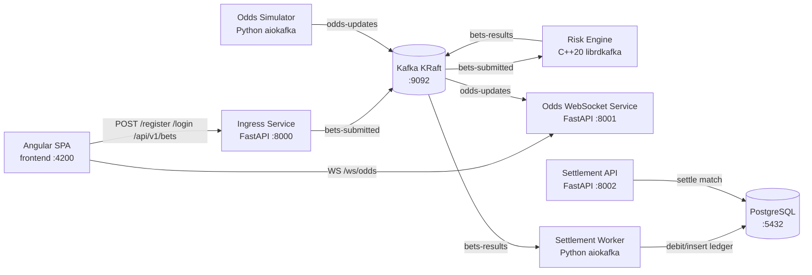
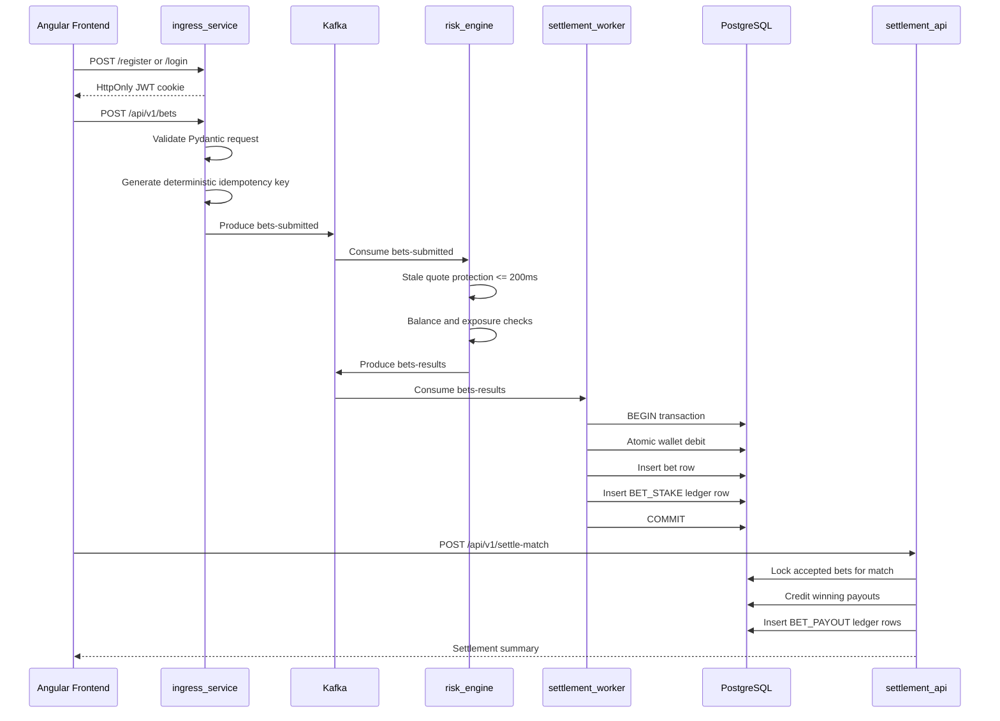
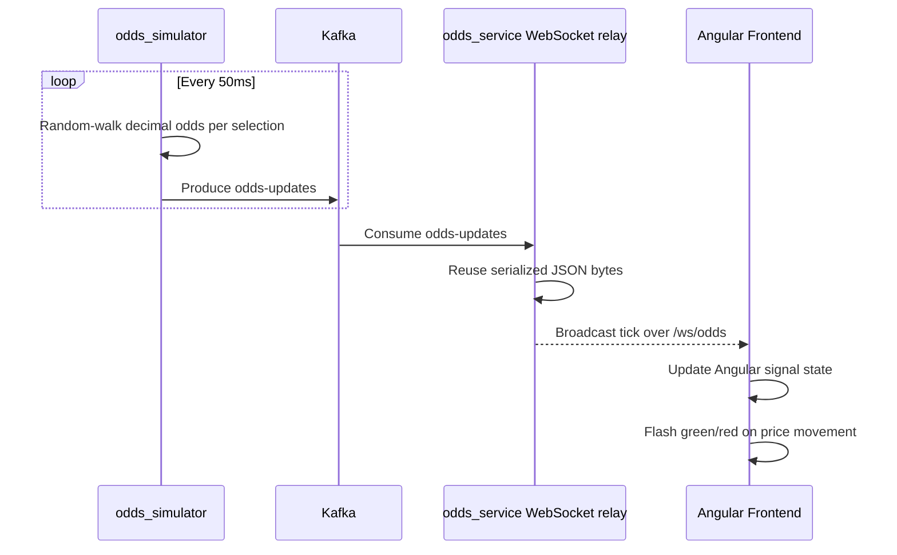

# Distributed Betting Platform Architecture

## Overview

This repository implements a distributed, event-driven betting platform composed of independent services connected through Kafka and PostgreSQL.

The system separates responsibilities across clear boundaries:

- **Ingress Service** accepts authenticated HTTP bet submissions and publishes immutable Kafka events.
- **Risk Engine** performs low-latency pre-trade checks in C++ and emits risk decisions.
- **Settlement Service** persists accepted/rejected bets, debits wallets, and settles completed matches.
- **Odds Service** streams simulated market odds to clients through Kafka and WebSockets.
- **Frontend** provides an Angular real-time trading interface.
- **PostgreSQL** stores users, wallets, bets, and immutable wallet ledger entries.
- **Kafka** is the event backbone for bets, odds, and settlement workflows.

## System Topology

```text
                         +----------------------+
                         |      Angular SPA     |
                         |      frontend/       |
                         | localhost:4200       |
                         +----------+-----------+
                                    |
              HTTP auth/bets        | WebSocket odds
              localhost:8000        | localhost:8001/ws/odds
                                    |
        +---------------------------+---------------------------+
        |                                                       |
+-------v--------+                                      +-------v--------+
| ingress_service |                                      | odds_service   |
| FastAPI         |                                      | FastAPI WS     |
| :8000           |                                      | :8001          |
+-------+--------+                                      +-------+--------+
        |                                                       ^
        | Kafka: bets-submitted                                |
        v                                                       | Kafka: odds-updates
+-------+-------------------------------------------------------+--------+
|                              Kafka                                  |
|                       KRaft broker :9092                            |
+-------+----------------------------+--------------------------+--------+
        |                            |                          ^
        | bets-submitted             | bets-results             |
        v                            v                          |
+-------+--------+           +-------+-------------+     +------+---------+
| risk_engine    |           | settlement_worker   |     | odds_simulator |
| Modern C++20   |           | Python aiokafka     |     | Python aiokafka|
| librdkafka     |           +----------+----------+     +----------------+
+-------+--------+                      |
        | bets-results                  | SQLAlchemy async / asyncpg
        v                               v
+-------+-------------------------------+--------+
|                  PostgreSQL :5432              |
| users, wallets, bets, wallet_ledger            |
+-------------------+----------------------------+
                    ^
                    |
          +---------+----------+
          | settlement_api     |
          | FastAPI :8002      |
          | /api/v1/settle-match|
          +--------------------+
```

## Mermaid Component Diagram



## Life of a Bet



## Life of an Odds Tick



## Data Flows

### Bet Flow

1. User authenticates through `ingress_service`.
2. Browser stores the JWT as an HttpOnly cookie.
3. User clicks a live odds selection and submits a stake.
4. `ingress_service` validates the request and publishes a `bets-submitted` event.
5. `risk_engine` consumes the event and applies:
   - stale quote protection,
   - single-account exposure cap,
   - atomic balance checks.
6. `risk_engine` publishes a `bets-results` event.
7. `settlement_worker` consumes the result and writes durable database state.
8. `settlement_api` later settles accepted bets for a match outcome.

### Odds Flow

1. `odds_simulator` emits market ticks every 50ms.
2. Ticks are published to Kafka topic `odds-updates`.
3. `odds_service` consumes the topic.
4. The WebSocket relay broadcasts raw JSON bytes to connected clients.
5. The Angular frontend updates signal state and renders price flashes.

## Port Mapping

| Component | Container Port | Host Port | Protocol | Purpose |
|---|---:|---:|---|---|
| `ingress-service` | 8000 | 8000 | HTTP | Auth and bet ingress API |
| `odds-service` | 8001 | 8001 | HTTP/WebSocket | Odds relay and health check |
| `settlement-api` | 8002 | 8002 | HTTP | Match settlement API |
| `kafka` | 9092 | 9092 | Kafka plaintext | External Kafka access |
| `postgres` | 5432 | 5432 | PostgreSQL | Database access |
| `frontend` | 4200 | 4200 | HTTP | Angular development server |

## Inter-Service Dependencies

| Service | Depends On | Reason |
|---|---|---|
| `ingress-service` | Kafka | Publishes `bets-submitted` |
| `risk-engine` | Kafka | Consumes `bets-submitted`, produces `bets-results` |
| `settlement-worker` | Kafka, PostgreSQL | Consumes results and persists state |
| `settlement-api` | PostgreSQL | Settles accepted bets |
| `odds-simulator` | Kafka | Publishes `odds-updates` |
| `odds-service` | Kafka | Consumes odds and relays over WebSocket |
| `frontend` | Ingress API, Odds WS, Settlement API | User interaction and E2E workflows |

## Reliability Boundaries

- Kafka decouples HTTP ingestion from risk evaluation and settlement persistence.
- `ingress_service` does not mutate bet or wallet database state.
- `risk_engine` manually commits offsets only after producing a result.
- `settlement_worker` uses database transactions and idempotency keys to prevent duplicate wallet deductions.
- `wallet_ledger` is append-only and records all monetary movements.

